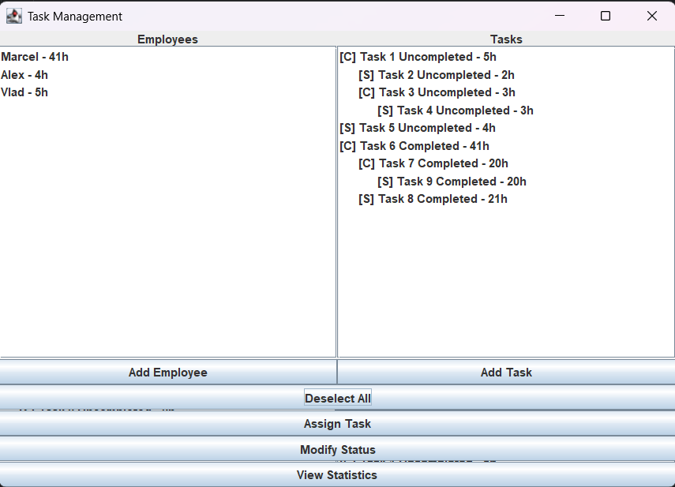
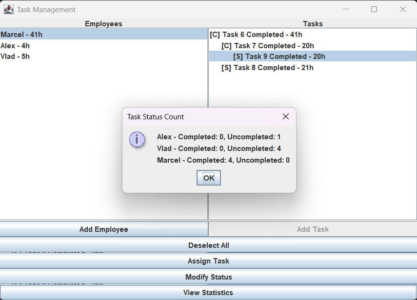

# 🗂️ Task Management Application

This project is a **Task Management System** developed for the *Fundamental Programming Techniques* course (Spring 2026, TUCN).
It allows a project manager to assign, track, and analyze tasks for employees through a graphical interface.

## 🎯 Features

* Add and manage employees
* Create **Simple Tasks** and **Complex Tasks**
* Assign tasks to employees
* Modify task status (Completed / Uncompleted)
* View employee workloads
* Generate statistics:

  * Employees with more than 40 hours of work
  * Number of completed/uncompleted tasks per employee
* Persistent data storage using **serialization**

## 🏗️ Project Structure

### 📦 Model

* **Task (abstract)** – Base class for all tasks
* **SimpleTask** – Task with start and end hours
* **ComplexTask** – Task composed of multiple subtasks
* **Employee** – Represents an employee

### ⚙️ Business Logic

* **TaskManagement**

  * Assign tasks to employees
  * Calculate total work duration
  * Modify task status

* **Utility**

  * Filter employees by workload (> 40h)
  * Compute task status statistics

### 💾 Data Access

* **DataManager**

  * Handles saving/loading data using serialization

### 🖥️ GUI

* **TaskManagementGUI (Swing)**

  * User interface for managing employees and tasks
  * Supports task creation, assignment, and statistics visualization

## 🧠 Key Concepts

* Object-Oriented Programming (OOP)
* Inheritance & Polymorphism
* Collections (`Map`, `List`)
* Java Swing GUI
* Serialization for persistence

## 📊 Example Functionalities

* Assign a **Complex Task** - automatically includes subtasks
* Mark tasks as completed - updates employee workload
* View statistics - identify overloaded employees
